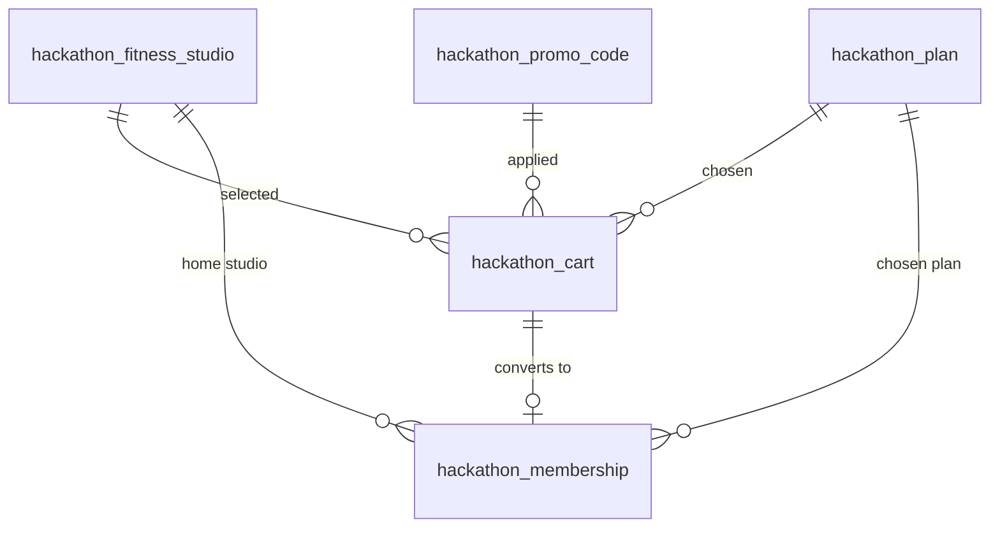

# YOND Gym — Database Model (hackathon)

Reverse-engineered from the prototype at [yndsgnp.lovable.app](https://yndsgnp.lovable.app/).
It's a gym membership signup funnel: **pick studio → pick plan → create profile (OTP) →
pay → done**. Supabase Auth handles login/OTP (`111111` in dev), so we only model the
business data.

## The funnel

| Step | Screen | Picks |
|------|--------|-------|
| 1 | Choose studio | one of ~12 studios |
| 2 | Plans | Core / Plus / Pro · term (1mo / 1yr −10% / 23mo −20%) · pay-upfront · Personal Training add-on (€299/mo) |
| 3 | Profile + Verify | email or phone → Supabase OTP |
| 4 | Payment | Card / SEPA / PayPal / Klarna · promo code · accept terms |

Prices are per 4 weeks: Core €49, Plus €59, Pro €79 (each −10% on annual).
Alt one-off products: Day Pass €10, 10-Pass €99, Consultation free.

## Architecture decisions

- **No Supabase Auth.** Too much security surface we don't need for a hackathon.
  Visitors are identified by a **client-generated `visitor_token`** (a UUID kept in
  `localStorage` + cookie). No passwords, no OTP, no sessions.
- **PostHog owns analytics.** The event stream (step views, selections, promo
  attempts), device / browser / OS / geo / referrer / UTM, and funnel drop-off all
  live in PostHog — we do **not** duplicate them in Postgres. We only keep
  `posthog_distinct_id` on our rows to correlate a DB record back to PostHog.
- **The DB is the transactional source of truth for the cart.** PostHog is
  analytics, not a store you can rebuild a half-finished checkout from — so the
  resumable funnel state lives in `hackathon_cart`.
- **Server-side writes.** All writes go through SvelteKit server routes using the
  Supabase **service key**. RLS is enabled everywhere; only the public catalog
  (plans, studios) has an anon read policy.

## Tables

Five tables: `hackathon_fitness_studio` (exists), `hackathon_plan`,
`hackathon_promo_code`, `hackathon_cart`, `hackathon_membership`.

> **Naming convention** (from the existing DB): tables are prefixed `hackathon_`,
> singular, snake_case, and use `text` + `CHECK` constraints instead of Postgres
> enums.

### `hackathon_fitness_studio` — the location list (public read)
This table **already exists** in the database with a rich schema; we don't
recreate it. Key columns the funnel uses: `id`, `name`, `city`, `country`,
`street`, `postal_code`, `latitude`/`longitude` (for "nearest first"), `status`
(`OPEN` / `COMING_SOON` / `CLOSED`), `type` (`EXPRESS` / `CLASSIC` / `PREMIUM` /
`XL`), plus amenity flags (`has_sauna`, `is_24_7`, …) and `opening_hours` jsonb.

### `hackathon_plan` — Core / Plus / Pro (public read)
| Column | Type | Notes |
|--------|------|-------|
| `id` | `uuid` PK | |
| `code` | `text` unique | `core` / `plus` / `pro` |
| `name` | `text` | "Core" |
| `tagline` | `text` | "Full access for independent training." |
| `price_monthly_cents` | `int` | list price / 4 weeks (4900) |
| `annual_price_cents` | `int` | discounted (4400) |
| `features` | `text[]` | the "What you get" bullets |
| `sort_order` | `int` | |

> Add-ons (Personal Training) and one-off products (Day Pass, 10-Pass, Consultation)
> are few and fixed — keep them as extra rows in `plans` with a `kind` column, or
> hardcode them in the frontend. Not worth their own tables for a hackathon.

### `hackathon_promo_code` — checkout discount (validate server-side)
| Column | Type | Notes |
|--------|------|-------|
| `code` | `text` PK | |
| `discount_percent` | `int` | 1–100 |
| `is_active` | `bool` | |

### `hackathon_cart` — resumable funnel state (the heart of it)
Identifies the visitor by device token, holds every selection as it's made, and
tracks lifecycle so the app knows whether to resume or start fresh. **One active
cart per visitor** (partial unique index on `visitor_token where status='active'`).

| Column | Type | Notes |
|--------|------|-------|
| `id` | `uuid` PK | |
| `visitor_token` | `uuid` | client-generated device id (no auth) |
| `posthog_distinct_id` | `text` null | correlate with PostHog |
| `status` | `text` | `active` / `abandoned` / `completed` |
| `current_step` | `text` | `studio` / `plan` / `profile` / `verify` / `payment` / `done` |
| `studio_id` | `uuid` null → studio | |
| `plan_id` | `uuid` null → plan | |
| `billing_term` | `text` null | `month` / `year` / `month_23` |
| `pay_upfront` | `bool` | |
| `personal_training` | `bool` | the `pt=1` add-on |
| `promo_code` | `text` null → promo | |
| `contact_channel` | `text` null | `email` / `phone` (profile step) |
| `contact_value` | `text` null | |
| `first_name` / `last_name` | `text` null | |
| `payment_method` | `text` null | card / sepa / paypal / klarna |
| `price_cents` | `int` null | computed total |
| `started_at` | `timestamptz` | |
| `last_activity_at` | `timestamptz` | drives abandonment |
| `completed_at` | `timestamptz` null | |
| `membership_id` | `uuid` null → membership | set on conversion |

**Resume flow:** returning device sends its `visitor_token` → server looks up the
`active` cart → hydrates the UI to `current_step` with saved selections. A cart goes
`abandoned` after N hours of inactivity (sweeper query or computed on read).

### `hackathon_membership` — the conversion record
Created from a cart at successful payment. No account — contact is stored inline.

| Column | Type | Notes |
|--------|------|-------|
| `id` | `uuid` PK | |
| `cart_id` | `uuid` unique → cart | the cart it converted from |
| `visitor_token` | `uuid` | |
| `posthog_distinct_id` | `text` null | |
| `studio_id` | `uuid` → studio | |
| `plan_id` | `uuid` → plan | |
| `billing_term` | `text` | `month` / `year` / `month_23` |
| `pay_upfront` / `personal_training` | `bool` | |
| `contact_channel` / `contact_value` | `text` null | |
| `first_name` / `last_name` | `text` null | |
| `payment_method` | `text` null | |
| `promo_code` | `text` null → promo | |
| `status` | `text` | `active` / `paused` / `cancelled` |
| `price_cents` | `int` null | locked-in total |
| `accepted_terms` | `bool` | |
| `created_at` | `timestamptz` | |

## RLS in one line

- **Public read:** `hackathon_fitness_studio`, `hackathon_plan` (catalog the funnel renders).
- **No anon policies** on `hackathon_cart`, `hackathon_membership`, `hackathon_promo_code`
  — RLS enabled, so only the **service key** (SvelteKit server routes) can touch them.
- **Promo:** `validate_promo_code(code)` RPC returns just the discount, never the table.
